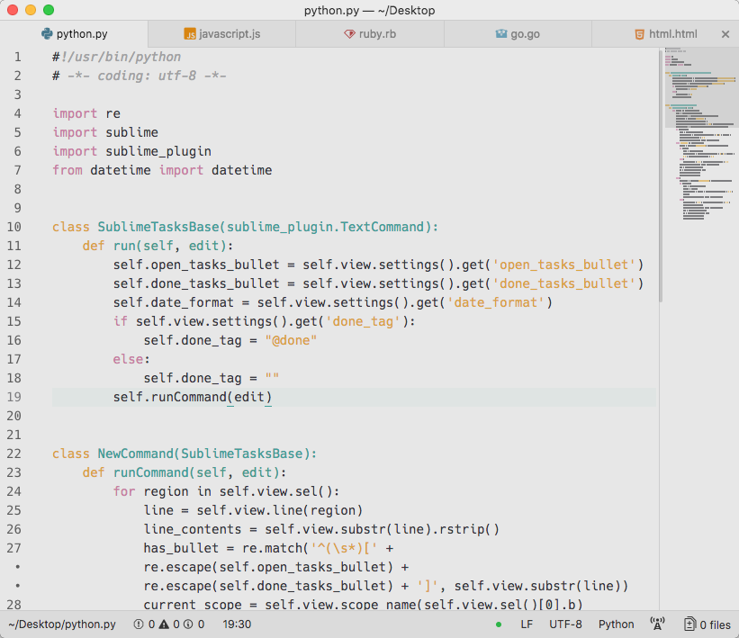
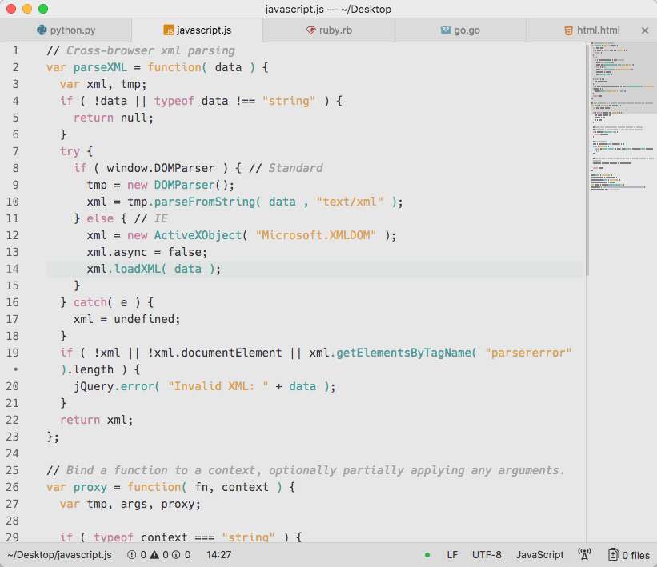
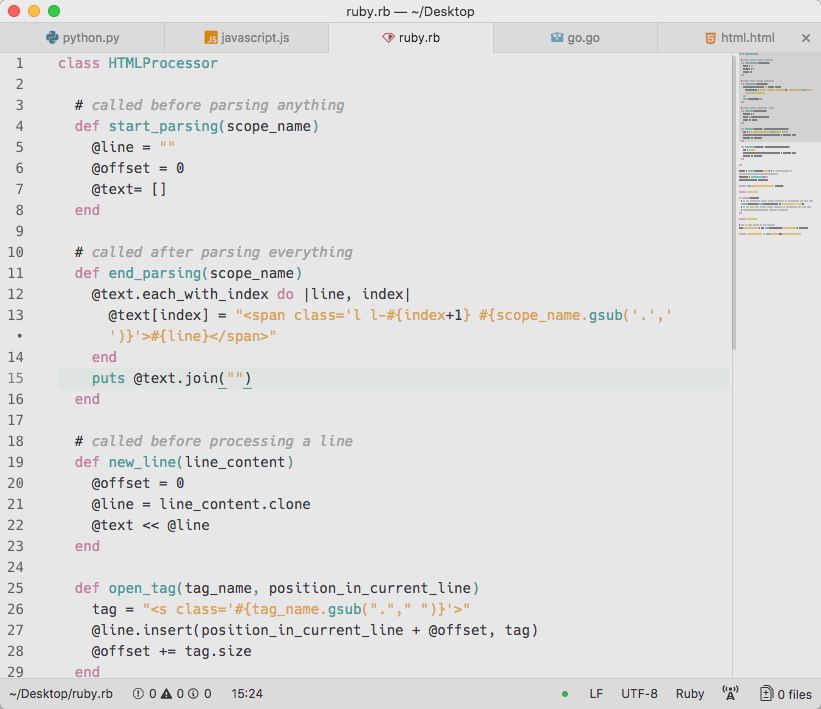
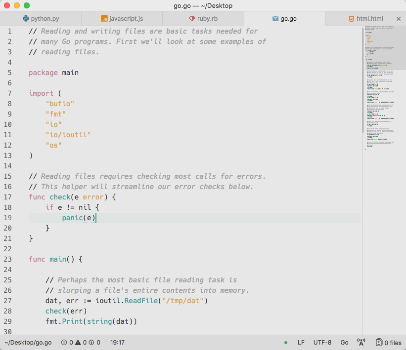
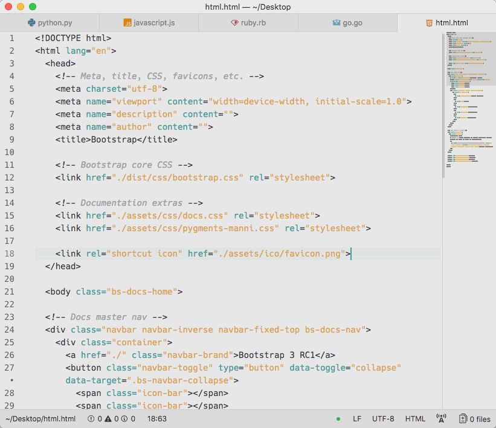

## [Agnostic Light Syntax](https://atom.io/themes/agnostic-light-syntax)

Agnostic Light is a muted syntax theme for Atom inspired by [eclectic-syntax](https://github.com/blaqbern/eclectic-syntax). It supports many languages and features meaningful colours without too much shine.

There is a [dark version](https://atom.io/themes/agnostic-dark-syntax) as well.

### Install

#### In Atom

1. Open the Settings pane in Atom (press `cmd` or `ctrl` + `,`).
2. Click **Install**.
3. Click **Themes**, then search for `agnostic-light-syntax`.
4. Click **Install** next to the theme when you see it listed in the search results.

#### From the command line

In a terminal session, run `apm install agnostic-light-syntax`.

### Examples

The UI theme in the examples is [one-light-ui](https://atom.io/themes/one-light-ui) and the typeface is [Hack](http://sourcefoundry.org/hack).

#### Python

#### JavaScript

#### Ruby

#### Go

#### HTML

---

Made with ♥ by [Adam Hollett](https://adamhollett.com/)
